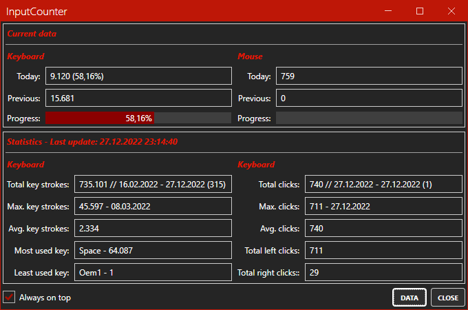
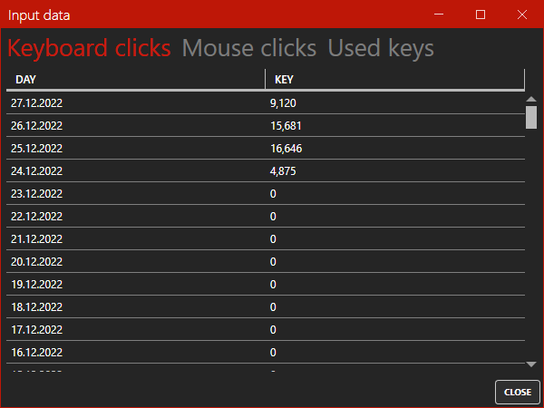
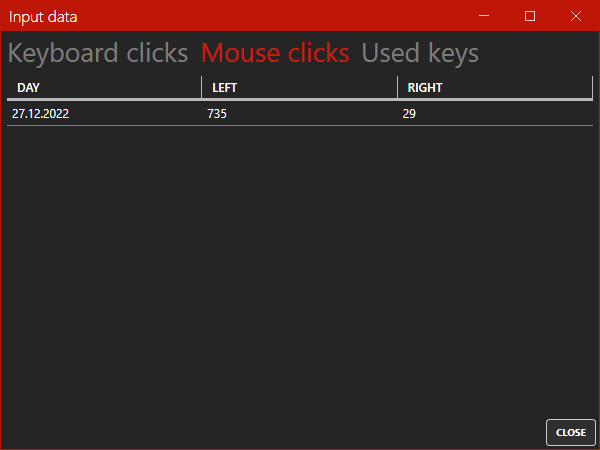
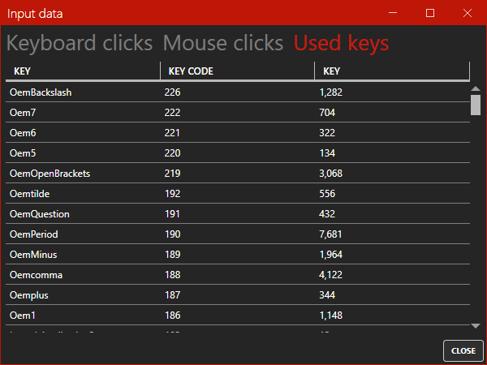

# InputCounter

[](https://github.com/InvaderZim85/InputCounter/releases/latest)
[](https://github.com/InvaderZim85/InputCounter/blob/main/LICENSE)


This is a small program which counts the keyboard strokes and the mouse clicks (left and right button).

This program is a new version of [KeyCount](https://github.com/InvaderZim85/KeyCount)

## Where is the data stored (aka Security / Keyboard-Sniffer)

The data is stored locally in an SQLite database (`InputCountDatabase.db`). The data is only used locally on the computer and is not transferred.

If you want to look at the data, you can use the free program [DB Browser](https://sqlitebrowser.org).

## How does it work?

The tool uses a low level keyboard and mouse hook to detect an action. So it can maybe possible that your anti virus tool will alert you.

I use Windows Defender and have had no problems so far

## Example

**Main window**



**Data window**







## Import data from KeyCount

If you've used the old [KeyCount](https://github.com/InvaderZim85/KeyCount) tool you can import your old data. There are two possible ways:

1. Manual: Use the DB Browser
2. Automatically: Use the *KeyCountImporter*

With the manual process you've more flexibility in what you want to import. The automatically process is easier.

### Automatic process

To use the automatic process, you've to do the following:

1. Navigate with powershell, cmd or windows terminal into the directory which contains the *KeyCountImporter* exe (*tools* directory)
2. Start the program with the following parameters:
    - `-s` / `--source` [Path of the KeyCount database]
    - `-t` / `--target` [Path of the InputCounter database]
    - `-o` / `--override` Add this switch to override the existing values. If you don't add this value, the values of the KeyCount will be added to the values of the InputCounter
    - `v` / `--verbose` Add this switch to create a verbose log
3. Done

Here is a small example:

```powershell
KeyCountImport.exe -s D:\Test\KeyCountDatabase.db -t D:\Test\InputCountDatabase.db -o -v
```
